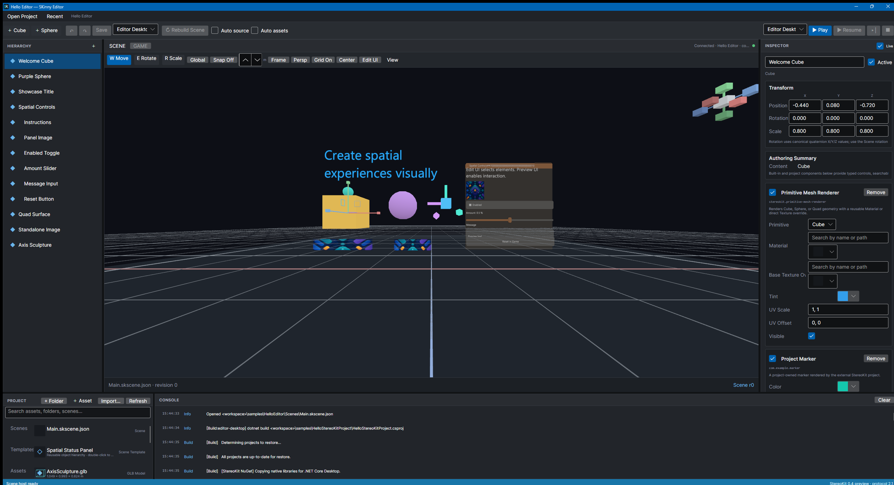
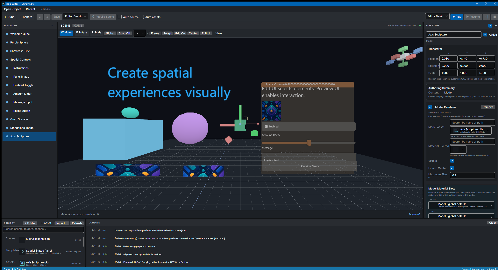
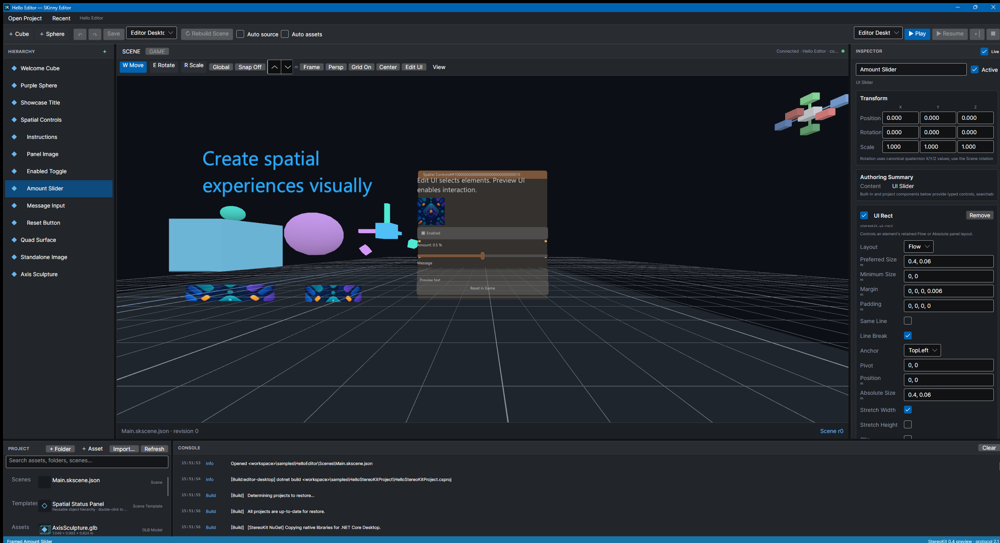
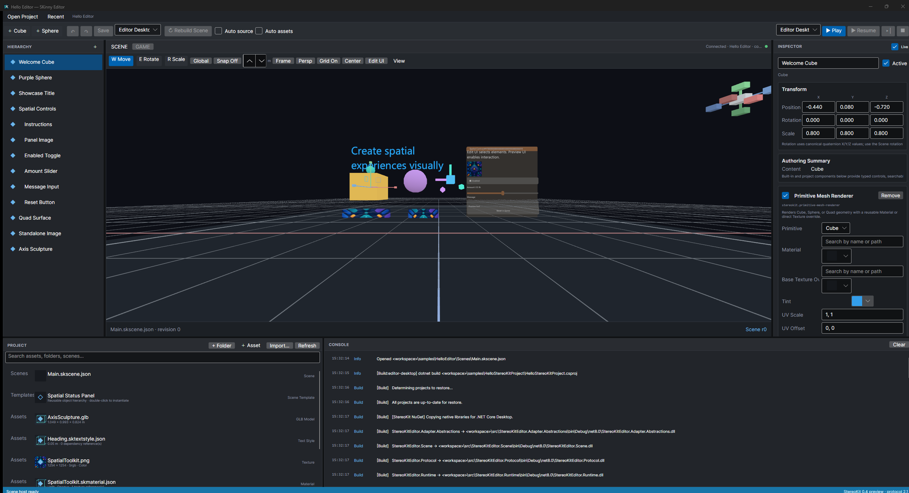
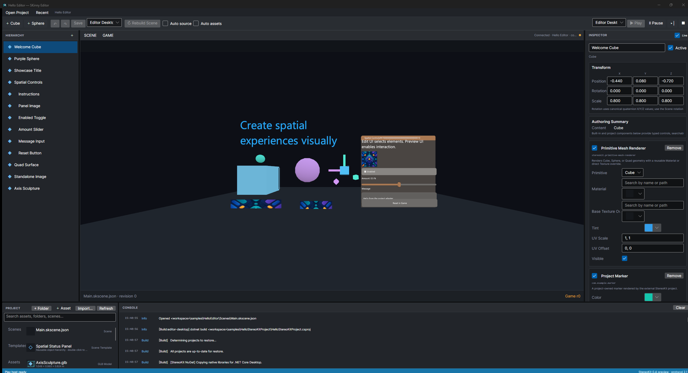
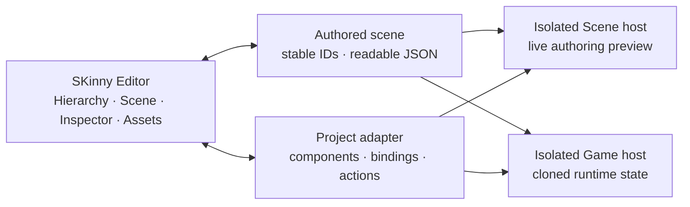

<p align="center">
  
</p>

<h1 align="center">SKinny Editor</h1>

<p align="center">
  <strong>A visual authoring environment for StereoKit projects.</strong>
</p>

<p align="center">
  Build scenes, arrange spatial interfaces, manage visual assets, and test project behavior without leaving one focused desktop workspace.
</p>

<p align="center">
  
  
  
  
  <a href="LICENSE"></a>
</p>

<p align="center">
  <a href="#get-started">Get started</a> ·
  <a href="#what-works-today">Features</a> ·
  <a href="docs/README.md">Documentation</a> ·
  <a href="docs/roadmap/README.md">Roadmap</a>
</p>



SKinny Editor brings the parts of a StereoKit project that benefit from direct manipulation into a visual scene editor. The application keeps authored data in readable, stable-ID scene files and runs project behavior through explicit adapters in isolated StereoKit processes.

> [!NOTE]
> SKinny Editor is an active **public preview, currently available for Windows**. The visual-authoring foundation, starter-project generator, and non-destructive existing-project importer are usable today; the full Project Hub, broader template/version selection, and deeper onboarding validation remain active product work. The portable ZIP remains the supported distribution.

## See the workflow

<table>
  <tr>
    <td width="50%" valign="top">
      
      <h3>Author the scene directly</h3>
      <p>Create and organize entities, edit transforms, frame selections, and work with move, rotate, and scale tools in an embedded StereoKit Scene view. The Inspector combines built-in content with project-owned components.</p>
    </td>
    <td width="50%" valign="top">
      
      <h3>Compose spatial interfaces</h3>
      <p>Build retained panels from text, images, toggles, sliders, inputs, buttons, spacers, and separators. Nested UI elements stay visible in the Hierarchy and expose dedicated layout, anchor, and resize controls.</p>
    </td>
  </tr>
  <tr>
    <td width="50%" valign="top">
      
      <h3>Keep assets connected</h3>
      <p>Import images and GLB models, create materials and text styles, organize folders, and keep references stable through asset moves. Thumbnails, dependency information, diagnostics, and protected deletion make the Project panel useful beyond simple file browsing.</p>
    </td>
    <td width="50%" valign="top">
      
      <h3>Test without risking the edit scene</h3>
      <p>Start an isolated Game session from a deep-cloned scene snapshot. Pause, advance one frame, stop, and inspect live runtime health while the always-on Scene process and authored document remain independent.</p>
    </td>
  </tr>
</table>

## What works today

### Scene authoring

- Hierarchical entities with child creation, multi-selection, inline rename, duplicate, delete, drag reparenting, and world-transform preservation.
- Move, rotate, and scale gizmos with local/global axes, center/active pivots, snapping, parent-transform support, Ctrl-drag duplication, and atomic undo history.
- Perspective and orthographic cameras, fly/orbit/pan navigation, normalized wheel zoom, arrow-key movement, an adaptive grid, fixed view presets, frame selection, and a clickable orientation widget.
- Resizable and persisted Hierarchy, Scene, Inspector, Project, and Console panels in a dark Windows desktop shell.

### Visual content and spatial UI

- Cubes, spheres, textured quads, standalone images, text, GLB models, environment settings, and editor annotations.
- Imported textures with color-space, usage, sampling, and addressing settings; reusable materials and text styles; stable sidecar identities and cached thumbnails.
- Retained spatial panels and typed UI elements with flow or absolute layout, nesting, anchors, margins, padding, stretching, clipping, and edit/preview interaction modes.
- Reusable scene-subtree templates that instantiate fresh entity and component IDs.

### Project integration

- Descriptor-driven build and launch of an independent StereoKit `.csproj`.
- A versioned adapter contract for project-owned components, bindings, actions, custom Inspector presentations, runtime lifecycle, asset resolution, and pick geometry.
- Stable-ID JSON scenes with unknown-component preservation, versioned migrations, atomic saves, deterministic reopen, undo/redo, and interrupted-session recovery.
- Searchable assets, referenced-delete protection, recoverable project trash, recent projects, selectable runtime profiles, and workspace trust before project code runs.

### Runtime isolation and reliability

- Separate embedded Scene and Game hosts connected through a versioned duplex protocol.
- Deep-cloned Play state, immutable build generations, stale-session reporting, pause/step/stop controls, and read-only runtime telemetry.
- Heartbeats, bounded runtime-log transport, automatic failed-host containment, one-attempt Scene recovery, structured diagnostics, redacted crash bundles, and Windows Job Object cleanup.
- Verified self-contained `win-x64` portable packaging and paired preview SDK packages.

## How a project connects



The adapter is the intentional boundary between a normal StereoKit project and the editor. Content explicitly represented in the scene and component catalog is authorable; arbitrary procedural objects created only by project code remain runtime-owned. This keeps onboarding non-destructive and lets a project continue to build and run normally outside SKinny Editor. See the [architecture overview](docs/architecture/overview.md) and [extension-authoring guide](docs/guides/extension-authoring.md) for the full model.

## Get started

### Requirements

- Windows 10 or 11
- .NET 8 SDK or newer
- A GPU and driver supported by StereoKit

### Download the public preview

Download `SKinny-Editor-0.3.0-preview.1-win-x64.zip` and its SHA-256 checksum
from [GitHub Releases](https://github.com/mr0ng/skinny-editor/releases). Extract
the archive to a user-writable directory and run `SKinny.Editor.exe`.

The executable is not code-signed yet, so Windows may display a trust or
SmartScreen warning. The packaged editor is self-contained, but building a
StereoKit project still requires the SDK and workloads used by that project.

### Build and launch the sample

```powershell
git clone https://github.com/mr0ng/skinny-editor.git
cd skinny-editor
dotnet restore StereoKitEditor.sln
dotnet build StereoKitEditor.sln
dotnet test StereoKitEditor.sln --no-build
dotnet run --project src/StereoKitEditor.App -- --project samples/HelloEditor/HelloEditor.skproject.json
```

The first launch asks you to trust the workspace before MSBuild or project code runs. Review the exact project, working directory, command, and environment-variable names, then choose **Trust and Run** only for source you trust.

You can also open a descriptor from **Open Project** or **Recent**, pass `--project <path>`, or set `SKINNY_PROJECT`. A portable build with no default project opens the project launcher.

### Essential shortcuts

| Action | Shortcut |
| --- | --- |
| Move / Rotate / Scale | `W` / `E` / `R` |
| Frame selection | `F` |
| Start Game | `F6` |
| Pause or resume | `F7` |
| Step one paused frame | `F8` |
| Stop Game | `Shift+F6` |

The [visual-authoring guide](docs/guides/visual-authoring.md) covers camera controls, transform gestures, selection, visual assets, and spatial UI in detail.

## Package the Windows preview

```powershell
powershell -NoProfile -ExecutionPolicy Bypass -File scripts\package-windows.ps1
```

The packaging gate produces a versioned self-contained editor, ZIP archive,
SHA-256 checksum, license notices, and four paired project SDK packages under
`artifacts/distribution`. See [installation and onboarding](docs/guides/installation-and-onboarding.md)
for the current portable workflow and project setup.

## Documentation

- [Documentation index](docs/README.md) — entry point for public technical and product documentation
- [Architecture overview](docs/architecture/overview.md) — processes, authoring boundary, asset identity, and trust model
- [Visual authoring guide](docs/guides/visual-authoring.md) — Scene controls, content, assets, and spatial UI
- [Extension authoring](docs/guides/extension-authoring.md) — project adapters, components, bindings, and actions
- [Installation and onboarding](docs/guides/installation-and-onboarding.md) — source launch, portable packaging, and project setup
- [Public roadmap](docs/roadmap/README.md) — completed foundations and upcoming product phases
- [Changelog](CHANGELOG.md) — public release history and known limitations

## Project status

The editor foundation, visual-content pipeline, spatial-UI vertical slice, isolated Scene/Game workflow, Windows portable distribution, starter-project generation, and transactional existing-project onboarding are implemented. The next product work focuses on the full Project Hub, broader template/version selection, and deeper trust-gated onboarding validation. Installer, signing, and automatic-update work is deferred until user demand shows that the portable workflow is insufficient. Hardware-dependent DPI, GPU, device-loss, and hands-on viewport acceptance continue alongside that work.

The current editor distribution and native embedding bridge target Windows. A future macOS edition can share the same scene, adapter, and asset formats while using its own platform integration; it is not part of the current delivery schedule.

## License

SKinny Editor is available under the [MIT License](LICENSE). Redistributed
components are documented in [third-party notices](THIRD-PARTY-NOTICES.md).
