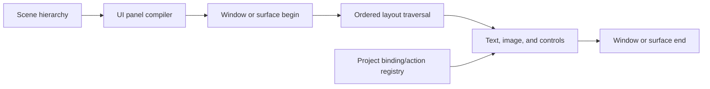
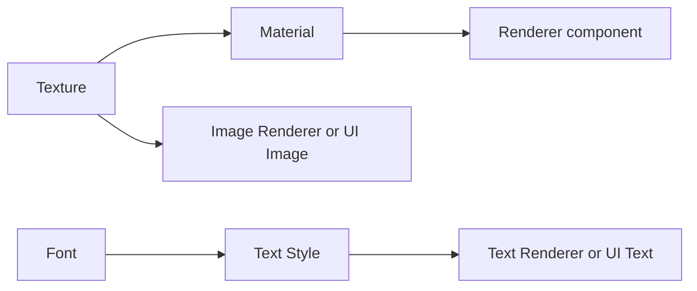

# Visual content, materials, text, and spatial UI authoring

Status: delivered preview capability with additional usability work tracked on the public roadmap.

Status: **implementation delivered — Phase 5; Windows authoring first**  
Roadmap date: **2026-08-08**

## Outcome

Phase 5 turns SKinny Editor's model-focused asset pipeline into a practical visual-content and spatial-UI authoring system. A developer should be able to:

- create Cube, Sphere, and Quad objects;
- import common image files as durable Texture assets;
- drag a Texture onto a compatible object and see it immediately in Scene and Game;
- create reusable Material assets and apply them to primitives, quads, and models;
- create an Image object that preserves an image's aspect ratio by default;
- create and style standalone 3D text, including wrapping and custom fonts;
- assemble spatial panels from text, images, and basic controls;
- edit panel structure and layout in Scene while keeping full interaction isolated to an explicit preview mode or Game;
- save, reopen, duplicate, template, undo, migrate, and package all of that content without storing machine-specific paths.

This phase does **not** promise to reconstruct arbitrary `UI.*`, `Text.Add`, `Mesh.Draw`, or `Sprite.Draw` calls already written in project code. Existing code-first UI remains runtime content unless the project exposes it through structured SKinny components.

## Implementation result

| Area | Delivered result |
|---|---|
| Built-in primitives | Cube, Sphere, and Quad with reusable Material, direct Texture override, tint, UV scale/offset, picking, and framing |
| Imported assets | `.glb`, image, and TrueType font assets with stable GUIDs, hashes, typed metadata, thumbnails, diagnostics, incremental refresh, and move-safe references |
| Authored assets | Standard/Unlit Materials and Text Styles with editable settings and transitive dependency/reference protection |
| Object rendering | Texture/Material assignment by typed picker or drag/drop; Image and Text renderers; global and per-slot model Material overrides |
| Spatial UI | Retained Panel/UI Rect hierarchy compiled to StereoKit UI with flow/absolute layout, selection, 2D resize/anchor handles, and Edit/Preview modes |
| Interaction | Button, Toggle, Slider, and Text Input use typed project-registered binding/action IDs; Game state remains isolated and is discarded on Stop |
| Packaging | Protocol `2.1`, adapter `0.3`, paired SDK packages, bundled assets/template, and isolated packaged Scene/Play verification |

The installed runtime is StereoKit `0.4.0-preview.3557`. Its APIs already provide the rendering foundation:

- [`Mesh.Quad`](https://stereokit.net/Pages/StereoKit/Mesh.html) for textured surfaces;
- [`Tex.FromFile`](https://stereokit.net/Pages/StereoKit/Tex/FromFile.html) for common image formats and sRGB/linear selection;
- [`Material`](https://stereokit.net/Pages/StereoKit/Material.html) and texture shader parameters for reusable surfaces;
- [`Sprite`](https://stereokit.net/Pages/StereoKit/Sprite.html) for aspect-aware image drawing;
- [`Text.Add`](https://stereokit.net/Pages/StereoKit/Text/Add.html), [`Text.Size`](https://stereokit.net/Pages/StereoKit/Text/Size.html), and [`Font.FromFile`](https://stereokit.net/Pages/StereoKit/Font/FromFile.html) for text rendering and measurement;
- [`UI.WindowBegin`](https://stereokit.net/Pages/StereoKit/UI/WindowBegin.html), layout areas, images, and text for spatial panels.

The hard part is therefore durable editor data, authoring behavior, asset dependency management, and Scene/Game ownership—not low-level rendering feasibility.

## Product boundaries

### Included

- Texture import for StereoKit-supported still-image formats, with PNG and JPEG as the first mandatory vertical slice.
- Texture metadata: dimensions, aspect ratio, alpha presence when detectable, color-space intent, sampling, addressing, source fingerprint, and diagnostics.
- Reusable built-in Material assets with Standard and Unlit shader families.
- Base color, normal, metal/roughness, occlusion, and emission texture slots where the selected shader supports them.
- Tint, metallic, roughness, emission, UV scale/offset, culling, transparency, alpha cutoff, depth-write, and bounded queue controls.
- Quad as a built-in primitive.
- Image Renderer as a convenience component distinct from a general textured Quad.
- Standalone Text Renderer with default/custom font, size, color, alignment, pivot, bounds, wrapping/fit, and optional billboarding.
- Font assets and reusable Text Style assets.
- Spatial UI Panel plus Text, Image, Spacer, Separator, Button, Toggle, Slider, and Text Input elements.
- Flow and explicit-rectangle layout modes, ordered by the scene hierarchy.
- Project-registered binding/action identifiers for interactive controls.
- Scene authoring, Game behavior, selection, picking, framing, gizmos, undo, templates, migration, recovery, packaging, and diagnostics.

### Explicitly deferred

- A node-based shader editor or arbitrary shader graph.
- Editing arbitrary project-authored immediate-mode UI calls.
- HTML/CSS layout compatibility.
- Animation timelines, animated GIF playback, video surfaces, and render-to-texture authoring.
- General visual scripting.
- A full 2D desktop-canvas mode unrelated to StereoKit's spatial UI.
- Automatic atlas authoring until StereoKit's atlas behavior and project evidence justify it.
- Platform-specific compression pipelines beyond source KTX2 support and documented runtime pass-through.

## Core design decisions

### 1. Texture, Material, Quad, and Image remain different concepts

- A **Texture** is an imported image asset with stable identity and import settings.
- A **Material** is a reusable authored asset that selects a shader family and references one or more textures.
- A **Quad** is geometry that can use any compatible material.
- An **Image Renderer** is a convenience component that directly references one texture and defaults to unlit, transparent, double-sided, aspect-preserving behavior.

This separation supports both simple workflows and reusable production materials without serializing raw StereoKit object handles.

### 2. Direct texture drop is convenient but does not create hidden assets

A renderer has a material binding:

- optional Material asset reference;
- optional per-object base-color Texture override;
- per-object tint;
- per-object UV scale and offset.

Dropping a Texture onto a Cube, Sphere, or Quad sets the visible override in one undoable command. Dropping a Material sets the material reference. SKinny must not silently create a folder full of generated material files.

### 3. Stable GUIDs remain the only durable asset references

Scene and authored-asset files store GUIDs, never absolute paths. Absolute paths only appear in the runtime-facing asset catalog. Image, font, material, and text-style sources use the same move-safe `.skmeta` identity and content-addressed cache policy already proven for GLB assets.

### 4. Spatial UI is retained for authoring and immediate at runtime

StereoKit UI must be called every frame. SKinny will store an ordered, retained hierarchy because that is what makes visual editing, undo, templates, migration, and diffing reliable. The isolated runtime compiles that hierarchy into `UI.WindowBegin`, layout, element, and `UI.WindowEnd` calls every frame.



### 5. Scene edit mode and UI interaction mode are explicit

Spatial controls can steal pointer input from selection and transform tools. Scene therefore gains a clear mode switch:

- **Edit UI**: UI interaction is suppressed; clicks select panel/element entities, layout bounds and resize handles are available, and editor commands own changes.
- **Preview UI**: controls can be exercised with design-time values, but project actions are disabled unless the user explicitly enables trusted preview behavior.
- **Game**: the cloned scene is fully interactive and project bindings/actions run normally.

Panel movement in Scene is performed through editor gizmos. Runtime-movable panel poses in Game are transient and discarded on Stop unless a future explicit apply-runtime-changes workflow is added.

### 6. UI elements use hierarchy order and a dedicated layout component

A UI Panel is a normal scene entity with Transform and `UiPanel`. Child entities contain one UI visual/control component plus `UiRect` layout data. Their ordinary Transform remains serialized for consistency but is not used while the child is layout-managed by a panel.

`UiRect` supports:

- Flow or Absolute placement;
- preferred/minimum width and height in meters;
- margin and padding;
- line break / same-line behavior for Flow;
- anchor, pivot, position, and size for Absolute;
- stretch on either axis;
- clipping policy where supported.

The Inspector must clearly state when Transform is inactive because panel layout owns placement. This avoids a hidden competition between two coordinate systems.

## Asset architecture

### Asset kinds

Extend the asset model with:

| Kind | Source | Runtime resource | Important metadata |
|---|---|---|---|
| Model | `.glb` | `Model` | Existing bounds/dependencies |
| Texture | `.png`, `.jpg/.jpeg`, `.tga`, `.bmp`, `.psd`, `.gif`, `.hdr`, `.pic`, `.ktx2` as verified | `Tex` | Width, height, aspect, color space, alpha, sampling, addressing |
| Font | `.ttf` first; additional formats only after a runtime probe | `Font` | Family/name when available, source hash, fallback order |
| Material | `.skmaterial.json` | `Material` | Shader family, texture dependencies, surface settings |
| Text Style | `.sktextstyle.json` | `TextStyle` | Font dependency, character height, color, optional material |

Use an importer registry rather than adding another model-specific branch to `AssetDatabase`. Each importer owns:

- recognized extensions;
- source inspection and settings validation;
- typed metadata creation;
- thumbnail generation or fallback icon;
- dependency extraction;
- runtime compatibility diagnostics;
- incremental fingerprint rules.

### Texture import settings

```text
colorSpace       sRGB | Linear
usage            Color | UI | Normal | MetalRough | Occlusion | Emission | Data
sampleMode       Linear | Point | Anisotropic
addressMode      Wrap | Clamp | Mirror
generateMipmaps  Auto | On | Off (only when supported by the runtime path)
alphaHint         Auto | Opaque | Transparent
```

Defaults:

- UI and Color textures use sRGB and Clamp for Image Renderer creation.
- Normal, MetalRough, Occlusion, and Data use Linear.
- General material textures default to Wrap unless usage implies UI.
- A usage/color-space mismatch produces a warning, not a silent conversion.

Editor thumbnails should use an explicit SkiaSharp dependency for common decoded formats already used by the Windows shell. Header readers and runtime validation cover formats Skia cannot preview. A valid-but-unpreviewable StereoKit texture remains importable with a clear generic thumbnail and diagnostic.

### Material asset schema version 1

```json
{
  "formatVersion": 1,
  "assetId": "guid",
  "shaderFamily": "Standard",
  "baseColorTextureId": "guid-or-null",
  "normalTextureId": "guid-or-null",
  "metalRoughTextureId": "guid-or-null",
  "occlusionTextureId": "guid-or-null",
  "emissionTextureId": "guid-or-null",
  "colorTint": [1, 1, 1, 1],
  "metallic": 0,
  "roughness": 1,
  "emissionFactor": 0,
  "uvScale": [1, 1],
  "uvOffset": [0, 0],
  "transparency": "Opaque",
  "alphaCutoff": 0.5,
  "cull": "Back",
  "depthWrite": true,
  "depthTest": "Less",
  "queueOffset": 0
}
```

The Inspector only exposes parameters supported by the selected shader family. Advanced depth/queue fields are collapsed by default and validated to safe bounded ranges.

### Dependency and deletion rules

The asset graph must represent transitive references:



- Deleting a referenced Texture lists Materials and scene entities that depend on it.
- Deleting a Material lists renderer users.
- Deleting a Font lists Text Styles and direct text users.
- Move/rename carries the sidecar and does not alter references.
- Recoverable Project trash continues to be the default deletion mechanism.
- Broken transitive references are preserved and visibly diagnosed; they are never silently nulled.

## Built-in scene components

### Primitive Mesh Renderer version 2

Add `Quad` to `PrimitiveKind` and evolve the renderer data to include:

- `primitive`: Cube, Sphere, or Quad;
- `materialAssetId`: optional;
- `baseColorTextureOverrideId`: optional;
- `color`: per-object tint;
- `uvScale`, `uvOffset`;
- `visible`.

Migration from version 1 supplies null references and identity UV values. Existing scenes retain their current appearance.

### Image Renderer version 1

Fields:

- Texture asset reference;
- size in meters;
- sizing mode: PreserveAspect, Stretch, Fit, Fill/Crop, or NativePixels using an explicit pixels-per-meter value;
- pivot/anchor;
- tint and opacity;
- double-sided;
- billboard mode: None, FaceCamera, or YAxisOnly;
- visible and render-layer/depth preset.

The default is PreserveAspect, centered pivot, unlit blend, depth-tested world rendering, depth-write off, and double-sided. Alpha-free textures may use the opaque path as an optimization without changing authored data.

### Text Renderer version 1

Fields:

- multiline text;
- optional Text Style asset;
- optional Font override;
- character height in meters;
- tint;
- layout width/height;
- fit mode and wrapping;
- horizontal/vertical alignment and pivot;
- billboard mode;
- visible and render-layer/depth preset.

Text is measured with StereoKit's text measurement APIs. The measured render bounds drive picking, selection outlines, and Frame Selection; a small depth epsilon makes ray picking reliable.

### UI Panel and elements

`UiPanel` fields:

- panel kind: Window, BodyOnly, HeaderOnly, or Surface;
- title and stable runtime ID derived from entity ID rather than display text;
- physical size and auto-size flags;
- movable-in-Game flag;
- far-interaction policy;
- visible/enabled;
- optional theme asset in a later compatible schema version.

Supported child element components for the first full panel milestone:

| Component | Runtime mapping | Authored state |
|---|---|---|
| UI Text | `UI.Label` or `UI.Text` | Text, style, alignment, wrapping |
| UI Image | `UI.Image` | Texture, tint, size, aspect behavior |
| UI Spacer | spacing/layout calls | Width and height |
| UI Separator | separator/panel visual | Orientation/style preset |
| UI Button | `UI.Button` / image button | Label/image, action ID |
| UI Toggle | `UI.Toggle` | Binding key, label, design value |
| UI Slider | slider API | Binding key, range, increment, units |
| UI Text Input | `UI.Input` | Binding key, placeholder, limits |

Unsupported or unknown element components remain serialized and appear as missing/opaque rather than being dropped.

## Runtime and adapter changes

### Typed runtime asset metadata

The runtime descriptor now exposes additive typed metadata for texture dimensions/settings, fonts, Materials, Text Styles, model slots, and authored dependencies alongside its stable kind/path/hash/bounds/diagnostics fields.

Recommended change:

- Protocol `2.1`: add optional metadata/dependency fields while retaining the protocol-major handshake.
- Adapter contract `0.3`: expose asset kind plus typed/JSON metadata and add kind-filtered resolution helpers.
- Keep scene format 2 unless serialization semantics change; new component types alone do not justify a whole-document format bump.

Older adapter binaries should fail the existing explicit adapter-contract compatibility check rather than guessing at the new metadata.

### Kind-filtered Inspector references

Extend `EditorPropertyDescriptor` with accepted asset kinds. A Texture field must not offer GLBs or fonts, and a Material field must not offer images directly. Built-in and project components use the same picker/filter mechanism.

### Runtime resource cache

Create frame-thread-owned caches keyed by asset GUID, content hash, and relevant import settings:

- Texture cache;
- Material cache;
- Font cache;
- Text Style cache.

Catalog changes invalidate only affected resources and dependents. Scene remains live when an image is edited on disk. If StereoKit cannot safely replace a resource in place, the documented correctness fallback is an isolated Scene restart—not stale rendering.

Shared Material assets are never mutated for per-object overrides. Tint is passed per draw where possible; override variants receive deterministic cache keys.

### UI binding/action contract

Serialized controls cannot contain delegates. Add a project-registered registry with stable string identifiers:

- value bindings: read, write, type, design-time value, validation;
- actions: invoke by ID with the source entity/control IDs;
- availability: Scene preview, Game, or both;
- diagnostics for missing or type-mismatched bindings.

Scene Edit never invokes project actions. Scene Preview uses design-time values by default. Game uses the cloned runtime state and project callbacks.

## Editor workflows

### Import an image

1. Choose **Import Image** or drag a supported file into the Project panel.
2. Preview destination and name; copy the source and create its `.skmeta` sidecar.
3. Inspect dimensions, alpha/color-space intent, thumbnail, settings, and diagnostics.
4. Refresh only the changed asset and its dependents.
5. Double-click or drag into Scene to create an Image entity.

### Create and texture a Quad

1. Choose **Create → 3D Object → Quad**.
2. The Quad appears facing the current Scene camera at the current placement pivot.
3. Drag a Texture onto it for a direct base-color override, or drag a Material for a reusable surface.
4. Use Transform for placement/scale and the Inspector for UV/material fields.

### Apply a texture or material to another object

- Dropping onto a compatible entity highlights the affected renderer and previews the operation.
- One drop creates one undoable command.
- Incompatible drops explain why and do nothing.
- Multi-selection can apply one material/texture to every compatible selected renderer as one compound command.

### Create text

1. Choose **Create → Text**.
2. Edit text directly through a multiline Inspector field.
3. Pick a Text Style or edit common overrides.
4. Resize the text bounds with 2D handles; wrapping and fit update live.
5. Scene picking and Frame Selection use measured glyph bounds.

### Build a spatial panel

1. Choose **Create → UI → Panel**.
2. Add child Text, Image, Spacer, Separator, or control elements from the Hierarchy context menu.
3. Reorder children to change flow order; nest layout groups where supported.
4. Switch to **Edit UI** for bounds/anchors and **Preview UI** for interaction.
5. Save the panel subtree as a reusable template when desired.

## Delivered implementation sequence

Phase 5 was delivered in dependency order. Phase 5A remained independent of product-entry work in Phase 4; Phase 5B was built after the texture/text foundations and runtime cache were established.

### Phase 5.0 — contracts, fixtures, and migration spine (delivered)

- Add importer registry and typed metadata design.
- Define Material, Text Style, renderer, and UI schemas.
- Add kind-filtered asset references and transitive dependency graph design.
- Create small PNG-with-alpha, JPEG, KTX2/header, font, material, and panel fixtures.
- Lock protocol `2.1` / adapter `0.3` compatibility tests.

Exit: schemas and compatibility behavior are reviewed, versioned, and covered before UI construction begins.

### Phase 5.1 — image/texture assets (delivered)

- Import, scan, fingerprint, sidecar, metadata, thumbnails, settings, diagnostics, move/rename, trash, and runtime catalog support.
- Add Project-panel Image import, file-type filters, thumbnails, kind labels, and texture Inspector.
- Add incremental reimport and missing/invalid-image tests.

Exit: imported textures survive rename/reopen, update incrementally, and resolve in isolated Scene and Game.

### Phase 5.2 — materials and textured renderers (delivered)

- Implement Material asset codec/editor/runtime cache.
- Add Quad primitive and Primitive Mesh Renderer v2 migration.
- Add direct texture/material drag-drop, asset pickers, UV fields, transparency, and multi-object application.
- Add global/per-slot model material overrides after GLB material-slot metadata is stable.

Exit: one imported texture can be applied to Cube, Sphere, Quad, and a documented model override path with correct save/undo/reload behavior.

### Phase 5.3 — Image Renderer (delivered)

- Add Image entity creation from menu, double-click, and drag.
- Implement size/aspect/pivot/billboard/transparency behavior.
- Add accurate picking, framing, bounds overlays, and 2D size handles.

Exit: an image can be placed as a world-space sign or panel decoration without manually authoring a Material.

### Phase 5.4 — fonts, text styles, and Text Renderer (delivered)

- Import fonts and create Text Style assets.
- Add standalone text component, multiline Inspector, measurement, wrapping/fit, style cache, picking, framing, and billboard modes.
- Test Unicode, missing glyph fallback, empty/very long strings, newlines, extreme sizes, and font reload.

Exit: styled text is authorable and visually consistent in Scene and Game, including reopen and packaging.

### Phase 5.5 — spatial UI panel and visual elements (delivered)

- Add UiPanel, UiRect, UI Text/Image/Spacer/Separator, retained hierarchy compiler, Edit/Preview mode, layout diagnostics, and selection bounds.
- Add panel and element resize/anchor handles.
- Provide a dashboard/status-panel sample and reusable template.

Exit: a user can construct a non-interactive spatial information panel from images and text without writing runtime draw code.

### Phase 5.6 — interactive controls and project bindings (delivered)

- Add Button, Toggle, Slider, and Text Input.
- Add stable action/binding registry, design values, Game state, and diagnostics.
- Verify pointer/hand/far interaction, keyboard focus, Scene selection isolation, Pause/Step, crash recovery, and Game discard behavior.

Exit: a sample project can bind a panel to real adapter state and actions without placing delegates or machine paths in scene JSON.

### Phase 5.7 — hardening and release integration (implementation delivered)

- Performance fixtures for hundreds of images/text elements and repeated materials.
- Transparency/order/depth tests, DPI/viewport input checks, cache invalidation, resource failure recovery, and GPU/device-loss hands-on checklist.
- Extend project templates, packaged example, onboarding compatibility report, authoring docs, SDK packages, and consolidated release verification.

Exit: the complete feature family passes source, packaged, migration, incremental-asset, Scene/Game, and hands-on visual acceptance gates.

The original planning envelope was **13–22 working weeks** for one experienced engineer, with Phase 5A useful after roughly **6–10 weeks**. The implementation was delivered as an accelerated integrated pass; the binding/state boundary remained the most consequential design work.

## Verification matrix

| Layer | Required automated evidence |
|---|---|
| Asset import | Every supported extension; dimensions/hash/settings; duplicate GUID repair; move/rename; incremental no-op; corrupt and missing source |
| Dependency graph | Texture → Material → renderer and Font → Text Style → text; delete protection and trash restore |
| Serialization | New component round trips; unknown fields survive; Primitive Renderer v1 → v2 migration; deterministic output |
| Commands | Create, assign, clear, multi-assign, reorder UI elements, resize, rename, delete, undo/redo |
| Runtime | Texture/material/font/style cache hits and invalidation; Scene/Game parity; transparent/opaque paths; missing-resource fallback |
| Picking | Thin Quad epsilon, aspect-aware image bounds, measured text bounds, nested panel elements, Frame Selection |
| UI ownership | Edit mode selects without firing controls; Preview uses design values; Game invokes bindings and discards clone state on Stop |
| Packaging | Bundled project restores without network for paired SDKs, imports sample assets, renders the sample panel in Scene/Game |
| Performance | No per-frame asset loads/material creation; bounded allocations; representative image/text/panel fixture maintains target frame time |

Repository verification now passes for the 92-test suite, native Scene input, clean adapter `0.3` package consumption, Windows ZIP/checksum/startup, and the bundled typed-asset Scene/Play probe. A captured packaged desktop frame confirms the Hierarchy/Project/Inspector integration, imported texture thumbnail, reusable template, and live Scene content. Cross-GPU alpha quality, DPI combinations, hand/controller feel, and graphics-device loss remain external release acceptance checks because one machine cannot close them honestly.

## Major risks and mitigations

### Transparent ordering and depth artifacts

Blend materials are order-sensitive and usually should not write depth. Provide safe presets, keep advanced controls bounded, show warnings for suspicious combinations, and include overlapping-panel visual fixtures.

### Asset color-space mistakes

Loading a normal/data map as sRGB produces incorrect results. Store explicit usage and color-space intent, choose safe defaults, and warn when a material slot conflicts with the Texture import role.

### Shared resource mutation

StereoKit assets are handle-based and materials are mutable. Cache immutable authored variants and never modify a shared Material to implement one object's override.

### UI input competing with editor input

Edit/Preview/Game modes are mandatory. Scene selection and gizmos own input in Edit; the UI runtime owns it only in Preview/Game.

### Immediate-mode UI state versus authored data

Runtime control state is transient. Binding/action IDs connect to project state; scene JSON stores design/default values, not a hidden live object graph.

### Scope expansion into a general UI framework

The first panel system maps a deliberate subset of StereoKit UI. New controls are added through versioned components and tests rather than attempting reflection over every API overload.

## Definition of done

The Phase 5 implementation is complete against the following criteria:

1. Quad, Image, Text, and UI Panel appear in normal create workflows.
2. Images and fonts import with stable IDs, thumbnails/metadata, diagnostics, incremental refresh, and move-safe references.
3. Textures/materials can be assigned through pickers and drag-drop to every declared compatible renderer.
4. Material and text-style dependencies participate in reference protection, trash, packaging, and compatibility reports.
5. Image aspect, text bounds, panel layout, selection, picking, framing, and resizing behave predictably.
6. Scene edits are undoable and synchronize immediately; Game uses an isolated clone and discards runtime state on Stop.
7. Spatial UI Edit and Preview modes prevent accidental control activation while authoring.
8. One packaged sample demonstrates a textured Quad, a textured 3D primitive, a standalone image, styled text, and an interactive panel.
9. Automated tests, native input, isolated Scene/Game probes, package consumption, and packaged verification pass; hardware-dependent visual/device-loss checks are explicitly carried by the external release checklist.
10. Documentation clearly distinguishes structured SKinny UI from arbitrary project-authored UI that remains opaque.
